# UA-Mask 架构说明

本文描述当前 `UA-Mask` 代码库的实际运行架构，重点覆盖：

- OpenWrt 侧如何把流量导入 UA-Mask
- Go daemon 的启动装配与生命周期
- TCP 会话、HTTP 探测、UA 改写的热路径
- 事件、目标画像、策略、流量卸载之间的关系
- 统计、LuCI 与防火墙 set 的集成方式
- SIGINT/SIGTERM 下的有序停止语义

当前架构只有一条生产流量路径：`proxy` 只负责接收与调度连接，业务热路径位于 `session`；目标级防火墙绕过统一通过 `events -> state -> policy -> offload -> firewall.Executor` 管线完成。旧的 `proxy.Processor` 与 `firewall.DecisionEngine` 已删除。

## 1. 总览

`UA-Mask` 是一个 OpenWrt REDIRECT 透明代理。OpenWrt 防火墙先把指定 TCP 流量重定向到本地监听端口，Go core 恢复原始目标地址并连接上游。

进入 core 后：

- HTTP 请求会读取 `User-Agent`，根据规则决定是否改写。
- 非 HTTP 流量会 fallback 成普通 TCP 转发，同时被记录为目标画像的一部分。
- 命中 UA 防火墙白名单，或多次表现为纯非 HTTP 的 `IP:Port`，会被动态加入 ipset/nfset。
- 被加入 set 的目标后续会在 OpenWrt 防火墙层直接 RETURN，不再进入 UA-Mask。

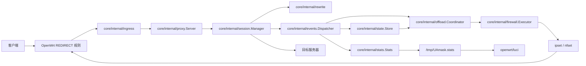

## 2. 目录与职责

```text
UA-Mask/
├── core/
│   ├── cmd/UAmask/             # 进程入口，只调用 app.Run(version)
│   └── internal/
│       ├── app/                # 运行时装配与生命周期
│       ├── config/             # JSON/legacy flags 加载、默认值、校验与运行时预处理
│       ├── ingress/            # REDIRECT 监听与原始目标地址恢复
│       ├── proxy/              # Accept 循环与 worker pool 调度
│       ├── session/            # 当前热路径中心：协议探测、转发、改写、事件发射
│       ├── rewrite/            # UA 判定、缓存、请求头改写
│       ├── events/             # 会话事件分发
│       ├── state/              # 按目标维护画像与冷却状态
│       ├── policy/             # 会话策略与目标卸载策略
│       ├── offload/            # 把策略信号转换为卸载动作
│       ├── firewall/           # 批量写 ipset/nfset
│       ├── stats/              # 事件计数与统计落盘
│       └── model/              # 跨模块共享的数据模型
├── openwrt/
│   ├── package/                # OpenWrt 包构建入口
│   ├── root/                   # init.d 与默认 UCI 配置
│   └── luci/                   # LuCI 页面
└── docs/
```

可以按三条线理解：

- **启动装配线**：`cmd -> app -> config -> runtime components`
- **请求热路径线**：`ingress -> proxy.Server -> session.Manager -> rewrite -> upstream`
- **卸载控制线**：`session events -> state/profile -> policy -> offload -> firewall set`

## 3. 启动与运行时装配

`core/cmd/UAmask/main.go` 是很薄的进程入口，只保存版本号并调用 `app.Run(version)`。

`app.Run()` 负责：

1. 调用 `config.NewFromFlags()` 解析进程参数，并按需加载版本化 JSON。
2. 按 `defaults -> JSON -> 显式 legacy flags -> normalize -> validate -> compile` 生成最终配置。
3. 处理 `-v`、`-check-config`、`-dump-effective-config` 等进程动作。
4. 应用 GC 参数并初始化 logrus。
5. 调用 `NewRuntime(cfg, version)` 装配所有运行时组件。
6. 监听 SIGINT/SIGTERM，并用对应 context 执行 `runtime.RunContext()`。

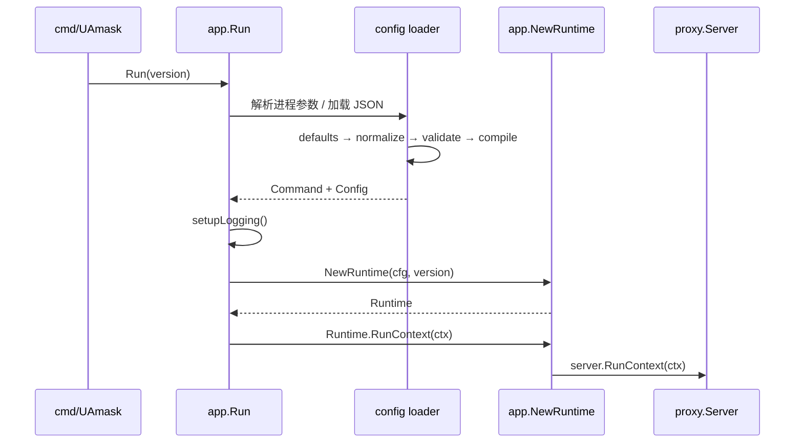

`app.NewRuntime()` 是当前最重要的代码图谱入口。它会创建：

- `stats.Stats` 与 `stats.FileReporter`
- `rewrite.UACache`
- `firewall.Executor`
- `rewrite.Engine` 与 `rewrite.RequestRewriter`
- `state.Store`
- `offload.FirewallTargetOffloader`
- `policy.SessionPolicy` 与 `policy.TargetPolicy`
- `events.Dispatcher`
- `offload.Coordinator`
- `session.DefaultManager`
- `ingress.Redirect`
- `proxy.Server`

装配关系如下：

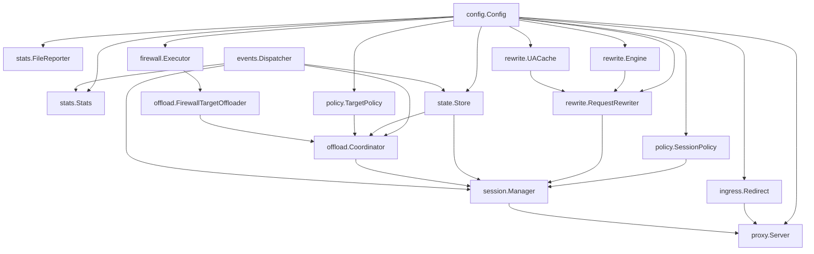

`Runtime.RunContext()` 的启动顺序是：

1. 打印配置。
2. 启动 `firewall.Executor` worker。
3. 启动 `state.Store` 清理 worker。
4. 启动 `stats.FileReporter` 落盘 worker。
5. 启动 `events.Dispatcher` 事件 worker。
6. 最后进入 `proxy.Server.RunContext()` 的 Accept 循环。

context 取消或 server 返回错误时：

1. `proxy.Server` 关闭 ingress，停止接收新连接，并丢弃 worker pool 中尚未开始处理的 session。
2. context 传入 `session.Manager`；拨号使用 `DialContext`，取消时同时关闭 client 和 upstream，再等待已开始的 handler 返回。
3. `offload.Coordinator.Stop()` 取消待决策 timer 并拒绝新动作。
4. `firewall.Executor.Flush()` 完成此前入队的批次与 completion，然后停止 worker。
5. `events.Dispatcher.WaitIdle()` 完成 result event 的状态和统计投影，然后停止分发器。
6. 最后停止 stats reporter 和 profile store。

这个顺序保证“停止接收流量”先于“停止控制面”，并且防火墙执行结果不会因为关闭顺序而丢失。

## 4. 配置模型

`config.Config` 已经按职责拆成几个子配置：

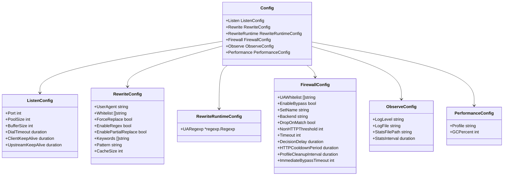

`RewriteConfig.Pattern` 保存用户输入语义，`RewriteRuntimeConfig.UARegexp` 保存编译后的正则。这样业务代码只消费已经预处理好的运行时配置。

OpenWrt LuCI/UCI 仍然是用户配置的唯一真相源。`openwrt/root/etc/init.d/UAmask` 使用 `jshn.sh` 将 core 所需字段写入 `/var/run/UAmask/config.json`，调用 `UAmask -check-config` 校验后原子替换，再通过以下命令启动：

```sh
/usr/bin/UAmask -config /var/run/UAmask/config.json
```

JSON 使用 `schema_version` 做显式版本管理，未知字段会导致加载失败。duration 使用 `30s`、`10m`、`8h` 等字符串，列表使用 JSON 数组。完整示例见 `docs/config.example.json`。

独立运行时支持以下进程级参数：

- `-config <path>`
- `-check-config`
- `-dump-effective-config`
- `-v`

旧业务 flags 暂时作为兼容覆盖层保留；优先级为默认值、JSON、显式 legacy flag。

## 5. 接入层：ingress 与 proxy

`ingress.Redirect` 负责本地监听和原始目标地址恢复。

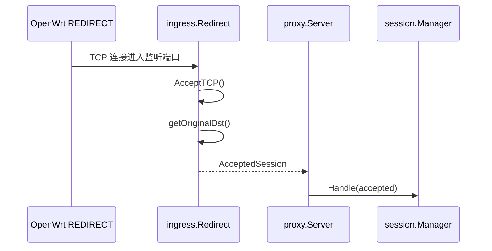

`proxy.Server` 当前只负责连接调度：

- 持有 `ingress.Ingress`
- 持有 `session.Manager`
- 根据 `ListenConfig.PoolSize` 选择 worker pool 或一连接一 goroutine
- 对每个 `AcceptedSession` 调用 `manager.Handle()`

这意味着 `proxy` 不再理解 UA 规则、状态画像或防火墙策略。

## 6. 热路径中心：session.Manager

`session.DefaultManager` 是当前最重要的热路径模块。它负责：

- 为每条连接创建 `SessionState`
- 连接原始目标上游
- 启动双向转发
- 在客户端到上游方向做 HTTP 探测
- 对 HTTP 请求调用 `rewrite.RequestRewriter`
- 对非 HTTP 流量 fallback 到 `io.Copy`
- 向 `events.Dispatcher` 发出会话事件
- 调用 `policy.SessionPolicy` 得到连接动作
- 把即时 offload signal 交给 `offload.Coordinator`

整体流程如下：

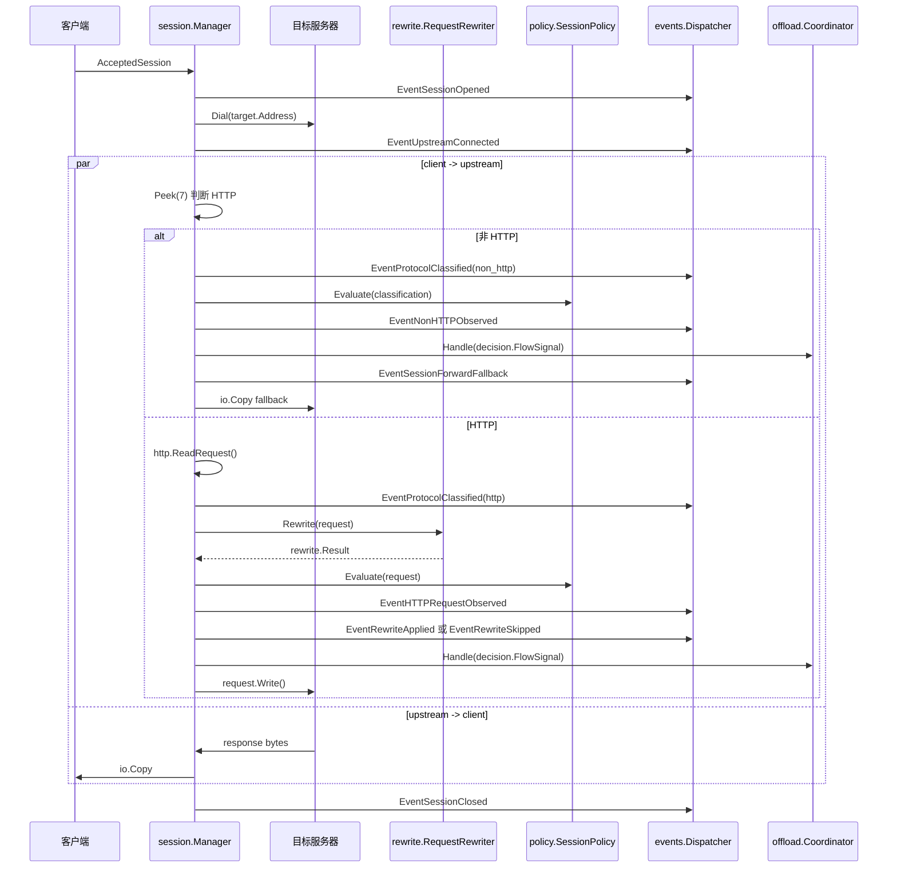

协议探测非常轻量：只 `Peek(7)` 并判断是否以常见 HTTP 方法开头。判断为非 HTTP 后，不再尝试解析应用层协议，而是记录事件并直接转发剩余 TCP 字节。

## 7. Rewrite 层

`rewrite` 层拆成三个对象：

- `Engine`：只根据 UA 和配置做纯决策。
- `UACache`：缓存 `originUA -> finalUA`。
- `RequestRewriter`：面向 `http.Request` 的封装，负责读写 Header 和串联缓存/决策。

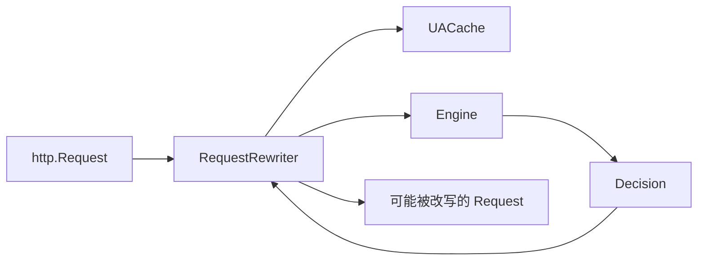

UA 决策顺序：

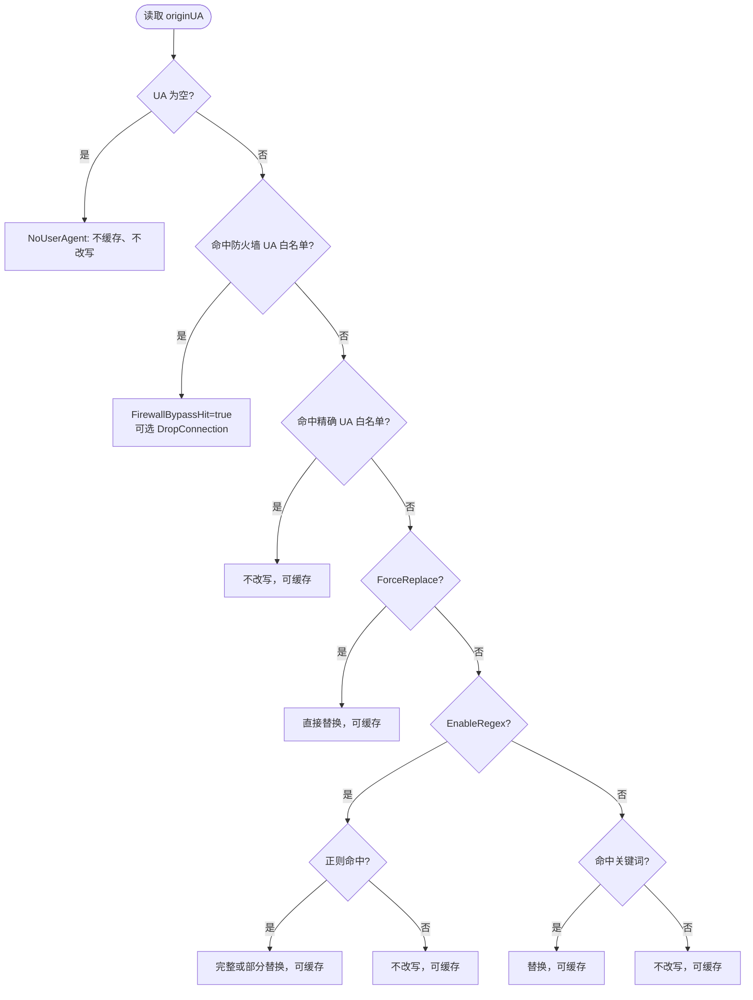

`Decision` 字段表达了后续模块需要知道的结果：

- `Matched`
- `Replace`
- `FinalUA`
- `Reason`
- `Cacheable`
- `FirewallBypassHit`
- `DropConnection`

`FirewallBypassHit` 不直接写防火墙，而是通过会话事件和目标策略进入卸载管线。

## 8. 事件模型

当前代码用 `model.SessionEvent` 作为模块之间的主要事实记录。

核心事件包括：

- `EventSessionOpened`
- `EventUpstreamConnected`
- `EventProtocolClassified`
- `EventHTTPRequestObserved`
- `EventRewriteApplied`
- `EventRewriteSkipped`
- `EventNonHTTPObserved`
- `EventSessionForwardFallback`
- `EventSessionClosed`
- `EventFlowOffloadSucceeded`
- `EventFlowOffloadFailed`
- `EventTargetOffloadSucceeded`
- `EventTargetOffloadFailed`

`events.Dispatcher` 是一个简单的异步 fan-out：

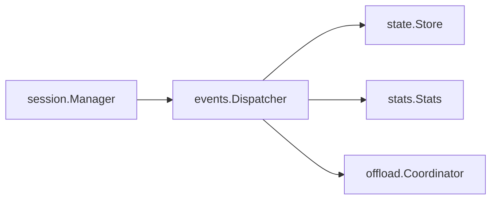

运行中 `Dispatcher.Append(event)` 会把事件放入固定容量的环形队列，由后台 worker 依次分发给 sink。队列满时拒绝最新事件并累计 `Dropped()` 计数，防止慢 sink 导致内存无限增长；`Stop()` 只排空调用时已经入队的事件，停止边界之后产生的新事件会被拒绝，确保关闭过程有限；未启动时则同步分发，便于测试。

## 9. 状态画像与策略

`state.Store` 按目标 `IP:Port` 维护 `TargetProfile`：

- `NonHTTPScore`
- `HTTPCooldownUntil`
- `LastActivity`
- `PendingTargetOffloadAt`
- `TargetOffloadUntil`
- `FirewallWhitelistHits`
- `LastFirewallHit`
- `LastEventType`
- `LastReason`

它消费事件并更新画像：

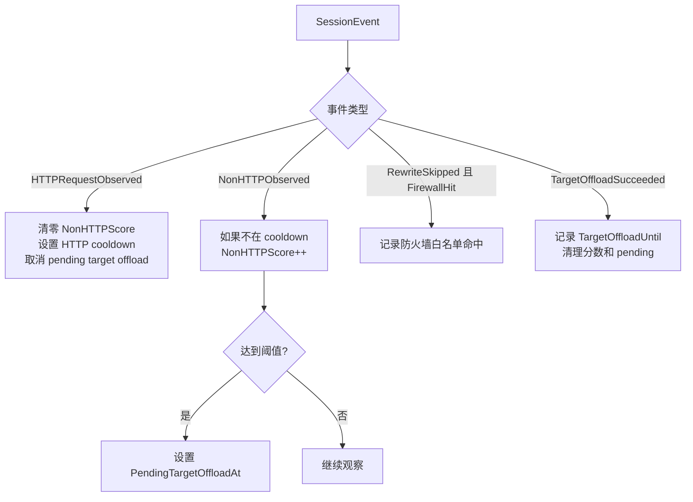

`policy` 有两类策略：

- `SessionPolicy`：根据一次会话输入决定继续、透传或断开。
- `TargetPolicy`：根据目标画像决定是否发出 `SignalTryTargetOffload`。

`TargetPolicy` 的两个主要触发条件是：

- HTTP 请求命中防火墙 UA 白名单，并产生 `EventRewriteSkipped` + `FirewallHit=true`。
- 非 HTTP 目标达到阈值，且经过 `DecisionDelay` 后仍不处于 HTTP cooldown。

两条路径的开关彼此独立：UA 防火墙白名单始终可产生目标卸载信号，`-fw-bypass` 只控制非 HTTP 画像与策略。

## 10. 流量卸载管线

`offload.Coordinator` 同时扮演两个角色：

- 作为 `events.Dispatcher` 的 sink，观察目标事件。
- 作为 `session.Manager` 的 signal handler，处理策略产生的卸载信号。

目标卸载流程如下：

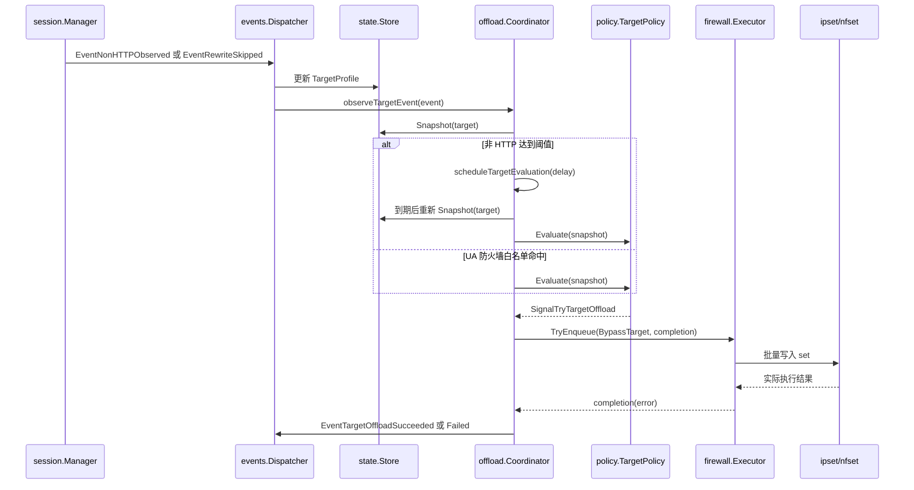

`offload.FirewallTargetOffloader` 把 `model.OffloadSignal` 转成 `firewall.BypassTarget` 并投递给 `firewall.Executor`。Coordinator 只在 Executor 的批处理命令实际完成后发出成功或失败事实；单纯进入队列不会再被视为卸载成功。

`NoopFlowOffloader` 当前是空实现，说明代码模型里预留了“单连接级 flow offload”的概念，但当前实际起作用的是目标级 `IP:Port` offload。

## 11. Firewall 执行层

`firewall.Executor` 是异步批处理执行器，不负责策略判断。

它的职责是：

- 校验 `BypassTarget`
- 接收待写入 set 的目标
- 按 `backend:setName` 分桶
- 对同一 `IP:Port` 去重
- 达到批次大小或最大等待时间后执行
- 停止时 drain 队列并执行剩余 batch

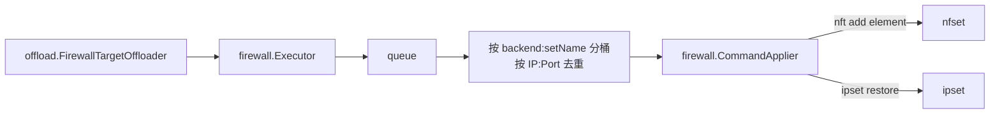

`firewall.CommandApplier` 根据 backend 选择命令：

- `nft`：执行 `nft add element inet fw4 <set> { ip . port timeout Ns }`
- `ipt`：执行 `ipset restore`

基础 REDIRECT 规则和 set 创建不在 Go 里完成，而是在 OpenWrt init 脚本里完成。Go 进程只动态追加需要绕过的目标。

## 12. Stats 与 LuCI

`stats.Stats` 是事件 sink，使用原子计数器记录：

- 当前连接数
- HTTP 请求总数
- UA 修改次数
- 缓存命中并修改次数
- 缓存命中但不修改次数

`stats.FileReporter` 周期性读取快照并写入 `/tmp/UAmask.stats`。

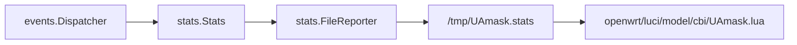

当前落盘指标包括：

- `current_connections`
- `total_requests`
- `rps`
- `successful_modifications`
- `direct_passthrough`
- `rule_processing`
- `cache_hit_modify`
- `cache_hit_pass`
- `total_cache_ratio`

LuCI 页面读取这个文件并展示运行状态、请求数、RPS、修改数和缓存效率。

## 13. OpenWrt 集成

OpenWrt 侧不是单纯打包壳，而是运行架构的一部分。

主要文件：

- `openwrt/package/Makefile`：构建并安装 Go daemon、init 脚本、默认配置、LuCI 文件。
- `openwrt/root/etc/config/UAmask`：默认 UCI 配置。
- `openwrt/root/etc/init.d/UAmask`：procd 生命周期、flags 转换、防火墙规则装配与清理。
- `openwrt/luci/model/cbi/UAmask.lua`：配置页面与统计展示。
- `openwrt/luci/controller/UAmask.lua`：LuCI 菜单入口。

服务启动关系：

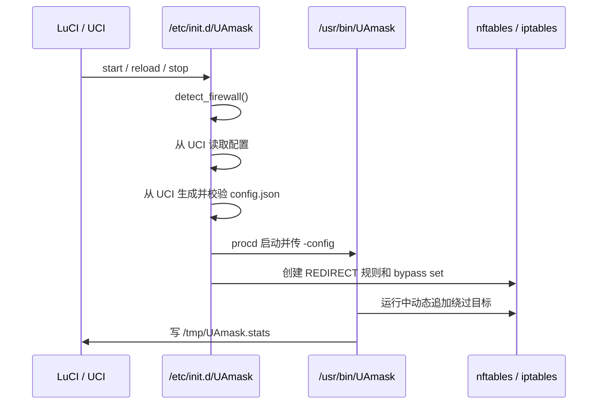

`init.d` 会根据是否存在 `fw4` 选择 nftables 或 iptables：

- nftables 路径：生成 `/tmp/UAmask_rules.nft`，注册为 firewall include，并创建 `inet fw4 UAmask_bypass_set`。
- iptables 路径：创建 `UAmask_prerouting`、`UAmask_output` 链，并可创建 `ipset hash:ip,port`。

当启用 `proxy_host` 时，init 脚本还会用 GID 规则避免 UA-Mask 自身流量和 OpenClash 流量再次被重定向。

## 14. 唯一生产路径与阅读顺序

旧的 `proxy.Processor`、`firewall.DecisionEngine` 和直接写防火墙的 sink 已删除。业务行为不得再绕过 `session -> event/state/policy/offload` 边界增加第二条路径。

`proxy.Server` 只负责 Accept、worker pool、活跃 session 跟踪和 context 关闭；HTTP 检测、rewrite、drop、fallback 和事件发射全部由 `session.Manager` 负责。`firewall` 只保留系统执行边界，目标状态与决策不放回该包。

建立代码图谱时按以下顺序阅读：

阅读代码时，应优先从这些入口建立图谱：

1. `core/cmd/UAmask/main.go`
2. `core/internal/app/app.go`
3. `core/internal/session/manager.go`
4. `core/internal/rewrite/engine.go`
5. `core/internal/events/dispatcher.go`
6. `core/internal/state/store.go`
7. `core/internal/policy/evaluator.go`
8. `core/internal/offload/coordinator.go`
9. `core/internal/firewall/executor.go`

## 15. 扩展点

当前代码最自然的扩展点在这些位置：

- 新增 UA 匹配模式：扩展 `rewrite.Engine`。
- 新增请求级行为：扩展 `policy.SessionPolicy` 与 `model.PolicyDecision`。
- 调整非 HTTP 卸载策略：扩展 `state.Store` 的画像字段或 `policy.TargetPolicy`。
- 支持新的防火墙后端：实现新的 `firewall.Applier` 或调整 `CommandApplier`。
- 增加观测方式：给 `events.Dispatcher` 添加新的 sink，或替换/扩展 `stats.FileReporter`。
- 实现真正的 flow-level offload：替换当前 `offload.NoopFlowOffloader`。

## 16. 一句话总结

当前 `UA-Mask` 可以理解成一条清晰的双管线：

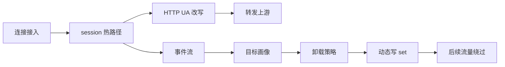

也就是：热路径负责尽快识别、改写、转发；控制路径异步观察流量特征，并把确定可以绕过的目标交给内核防火墙处理。
